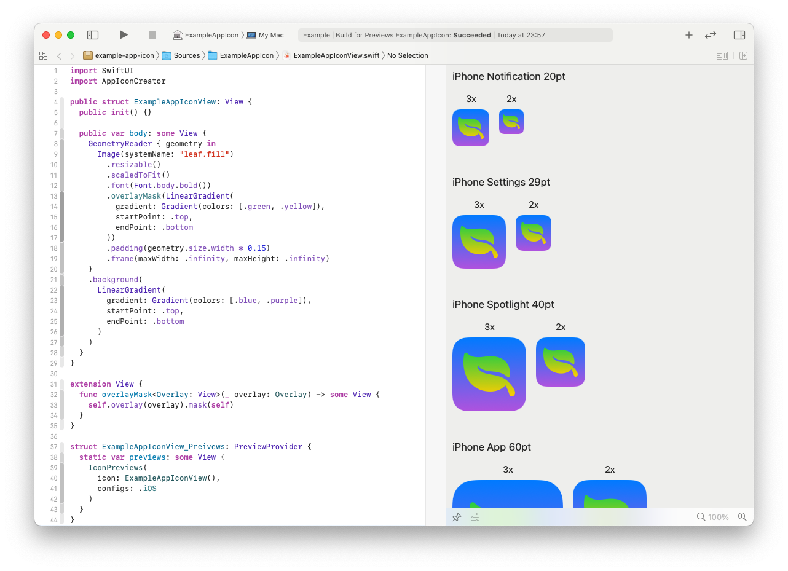
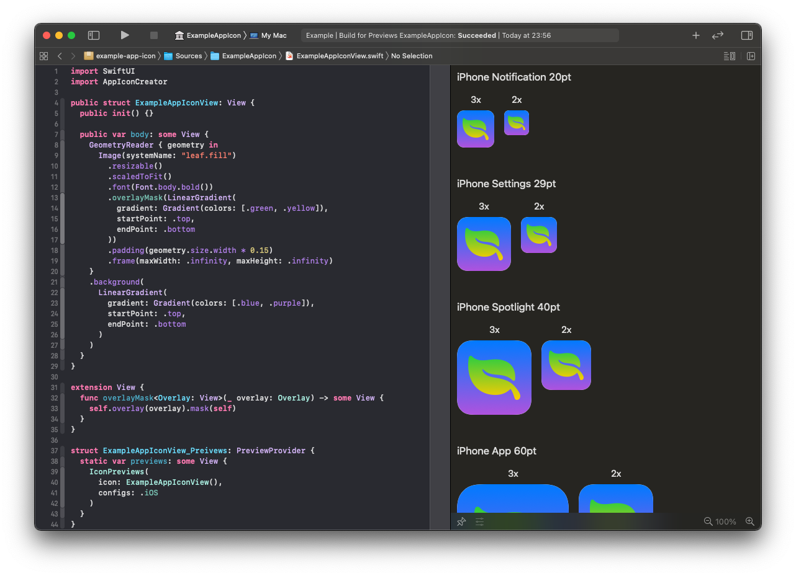

# SwiftUI App Icon Creator


Create iOS and macOS application icon in Xcode with SwiftUI

*Xcode 12 and macOS 11 required*



<details>
  <summary>Dark mode supported</summary>

  

</details>

## 📝 How to

**TL;DR:** check out [example project](Example) in this repository.

#### 1️⃣ Create a new Swift Package

Define two products in your `Package.swift`:

- Library that will contain your icon source code
- Executable that you will use to export icon images

Add `swiftui-app-icon-creator` package as a dependency.

Your `Package.swift` should like this:

```swift
// swift-tools-version:5.3
import PackageDescription

let package = Package(
  name: "my-app-icon",
  platforms: [.macOS(.v11)],
  products: [
    .library(name: "MyAppIcon", targets: ["MyAppIcon"]),
    .executable(name: "export", targets: ["Export"])
  ],
  dependencies: [
    .package(url: "https://github.com/darrarski/swiftui-app-icon-creator.git", from: "1.0.0")
  ],
  targets: [
    .target(name: "MyAppIcon", dependencies: [
      .product(name: "AppIconCreator", package: "swiftui-app-icon-creator")
    ]),
    .target(name: "Export", dependencies: ["MyAppIcon"])
  ]
)
```

#### 2️⃣ Create an icon view in the library target, using SwiftUI

Just create a new SwiftUI view in the library target:

```swift
import SwiftUI

public struct MyAppIconView: View {
  public init() {}

  public var body: some View {
    // ...  
  }
}
```

#### 3️⃣ Use `IconPreviews` to live-preview your icon in Xcode

Add this code to the file which contains your icon view:

```swift
import AppIconCreator

struct MyAppIconView_Preivews: PreviewProvider {
  static var previews: some View {
    IconPreviews(
      icon: MyAppIconView(),
      configs: .iOS
    )
  }
}
```

Make sure you have selected the build scheme connected with your library target (`MyAppIcon` in this example).

You should be able to live-preview the icon in Xcode previews.

You can adjust the `configs` parameter to specify which types of icons you want to preview. Check out [`IconConfig.swift`](Sources/AppIconCreator/IconConfig.swift) for possible options.

#### 4️⃣ Add exporting code to the executable target

Add this code to `main.swift` file in your executable target:

```swift
import AppIconCreator
import MyAppIcon
import Foundation

let icon = MyAppIconView()
let configs = [IconConfig].iOS
let images = [IconImage].images(for: icon, with: configs)
let exportURL = FileManager.default.homeDirectoryForCurrentUser.appendingPathComponent("Desktop").appendingPathComponent("MyAppIcon")
images.forEach { $0.save(to: exportURL) }
```

You can adjust the `configs` variable to specify which types of icons you want to export. Check out [`IconConfig.swift`](Sources/AppIconCreator/IconConfig.swift) for possible options.

In the above example, the images will be exported to `MyAppIcon` directory on the current user's desktop. Feel free to adjust the `exportURL` variable to your needs.

#### 5️⃣ Run the executable from Xcode to export your icon images

Make sure you have selected the build scheme connected with your executable target (`export` in this example).

Images of your icon should be exported into a directory specified in `exportURL` variable.

## ☕️ Do you like the project?

<a href="https://www.buymeacoffee.com/darrarski" target="_blank"></a>

## 📄 License

Copyright © 2020 Dariusz Rybicki Darrarski

License: [MIT](LICENSE)
